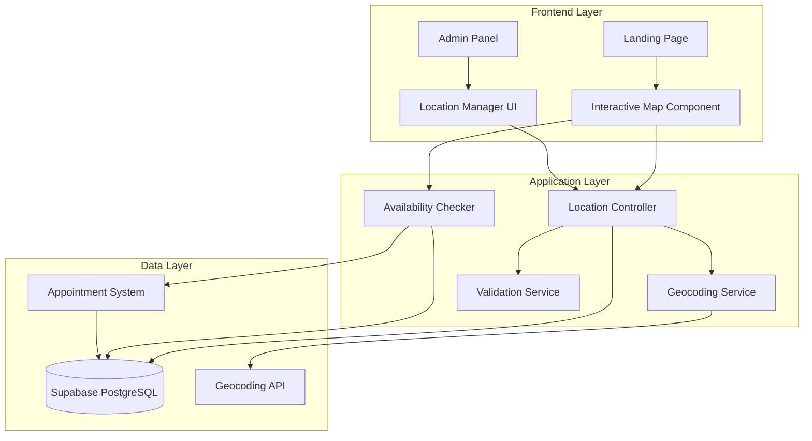

# Design Document: Clinic Location Management

## Overview

This design document specifies the technical architecture for the clinic location management system. The system enables administrators to manage multiple dental clinic locations through an admin panel and allows users to view clinics on an interactive map, check appointment availability, and select a clinic for booking.

### Key Features

- **Admin Location Management**: CRUD operations for clinic locations with validation
- **Interactive Map Visualization**: Leaflet-based map with clinic pins and real-time updates
- **Availability Integration**: Real-time appointment availability checking
- **Clinic Selection Flow**: Seamless integration with existing appointment booking system
- **Responsive Design**: Mobile-first approach with accessibility compliance

### Technology Stack

- **Frontend**: React 18 with TypeScript, Vite build system
- **State Management**: Zustand for global state, TanStack Query for server state
- **Database**: Supabase (PostgreSQL) with Row Level Security
- **Mapping**: Leaflet with React-Leaflet bindings
- **Validation**: Zod schemas for runtime type checking
- **Testing**: Vitest with fast-check for property-based testing
- **Styling**: Tailwind CSS for responsive design

## Architecture

### System Architecture



### Component Architecture

The system follows a layered architecture pattern:

1. **Presentation Layer**: React components for UI rendering
2. **Business Logic Layer**: Custom hooks and services for data operations
3. **Data Access Layer**: Supabase client with typed queries
4. **External Integration Layer**: Geocoding API and appointment system integration

### Data Flow

**Admin Location Management Flow**:
1. Admin enters location data in form
2. Validation service validates input (coordinates, address format)
3. Geocoding service optionally converts address to coordinates
4. Location controller persists to Supabase
5. Real-time subscription updates map view

**User Clinic Selection Flow**:
1. Landing page loads active clinics from Supabase
2. Map component renders pins with availability indicators
3. User clicks pin to view details
4. Availability checker queries appointment system
5. User selects clinic and navigates to booking flow with pre-selected clinic

## Components and Interfaces

### Database Schema

#### Clinics Table Enhancement

The existing `clinics` table will be enhanced with additional fields:

```sql
CREATE TABLE IF NOT EXISTS clinics (
  id UUID PRIMARY KEY DEFAULT gen_random_uuid(),
  name TEXT NOT NULL,
  address TEXT NOT NULL,
  latitude NUMERIC(10, 8) NOT NULL CHECK (latitude >= -90 AND latitude <= 90),
  longitude NUMERIC(11, 8) NOT NULL CHECK (longitude >= -180 AND longitude <= 180),
  phone TEXT NOT NULL,
  whatsapp TEXT NOT NULL,
  operating_hours JSONB NOT NULL DEFAULT '{}',
  special_hours JSONB DEFAULT '[]',
  is_active BOOLEAN NOT NULL DEFAULT true,
  is_deleted BOOLEAN NOT NULL DEFAULT false,
  created_at TIMESTAMPTZ NOT NULL DEFAULT NOW(),
  updated_at TIMESTAMPTZ NOT NULL DEFAULT NOW()
);

-- Indexes for geographic queries
CREATE INDEX IF NOT EXISTS idx_clinics_location ON clinics USING GIST (
  ll_to_earth(latitude, longitude)
);

CREATE INDEX IF NOT EXISTS idx_clinics_active ON clinics (is_active) 
  WHERE is_active = true AND is_deleted = false;

-- Trigger for updated_at
CREATE OR REPLACE FUNCTION update_updated_at_column()
RETURNS TRIGGER AS $$
BEGIN
  NEW.updated_at = NOW();
  RETURN NEW;
END;
$$ LANGUAGE plpgsql;

CREATE TRIGGER update_clinics_updated_at
  BEFORE UPDATE ON clinics
  FOR EACH ROW
  EXECUTE FUNCTION update_updated_at_column();
```

**Operating Hours Schema**:
```typescript
{
  "monday": { "open": "08:00", "close": "18:00", "closed": false },
  "tuesday": { "open": "08:00", "close": "18:00", "closed": false },
  "wednesday": { "open": "08:00", "close": "18:00", "closed": false },
  "thursday": { "open": "08:00", "close": "18:00", "closed": false },
  "friday": { "open": "08:00", "close": "18:00", "closed": false },
  "saturday": { "open": "09:00", "close": "14:00", "closed": false },
  "sunday": { "open": "00:00", "close": "00:00", "closed": true }
}
```

**Special Hours Schema**:
```typescript
[
  {
    "date": "2024-12-25",
    "reason": "Christmas",
    "closed": true
  },
  {
    "date": "2024-12-31",
    "reason": "New Year's Eve",
    "open": "08:00",
    "close": "14:00",
    "closed": false
  }
]
```

### TypeScript Interfaces

```typescript
// Enhanced Clinic interface
export interface Clinic {
  id: string
  name: string
  address: string
  latitude: number
  longitude: number
  phone: string
  whatsapp: string
  operating_hours: OperatingHours
  special_hours: SpecialHour[]
  is_active: boolean
  is_deleted: boolean
  created_at: string
  updated_at: string
}

export interface OperatingHours {
  monday: DayHours
  tuesday: DayHours
  wednesday: DayHours
  thursday: DayHours
  friday: DayHours
  saturday: DayHours
  sunday: DayHours
}

export interface DayHours {
  open: string // HH:mm format
  close: string // HH:mm format
  closed: boolean
}

export interface SpecialHour {
  date: string // YYYY-MM-DD format
  reason: string
  open?: string // HH:mm format
  close?: string // HH:mm format
  closed: boolean
}

export interface ClinicWithAvailability extends Clinic {
  available_slots_30d: number
  available_slots_7d: number
  has_availability: boolean
  is_open_now: boolean
}

export interface CreateClinicDTO {
  name: string
  address: string
  latitude: number
  longitude: number
  phone: string
  whatsapp: string
  operating_hours: OperatingHours
  special_hours?: SpecialHour[]
}

export interface UpdateClinicDTO {
  name?: string
  address?: string
  latitude?: number
  longitude?: number
  phone?: string
  whatsapp?: string
  operating_hours?: OperatingHours
  special_hours?: SpecialHour[]
  is_active?: boolean
}

export interface GeocodingResult {
  latitude: number
  longitude: number
  formatted_address: string
  confidence: 'high' | 'medium' | 'low'
}

export interface AvailabilityQuery {
  clinic_id: string
  start_date: string
  end_date: string
}

export interface AvailabilityResult {
  clinic_id: string
  available_slots: number
  next_available_date: string | null
}
```

### Zod Validation Schemas

```typescript
import { z } from 'zod'

const DayHoursSchema = z.object({
  open: z.string().regex(/^([0-1][0-9]|2[0-3]):[0-5][0-9]$/),
  close: z.string().regex(/^([0-1][0-9]|2[0-3]):[0-5][0-9]$/),
  closed: z.boolean()
})

const OperatingHoursSchema = z.object({
  monday: DayHoursSchema,
  tuesday: DayHoursSchema,
  wednesday: DayHoursSchema,
  thursday: DayHoursSchema,
  friday: DayHoursSchema,
  saturday: DayHoursSchema,
  sunday: DayHoursSchema
})

const SpecialHourSchema = z.object({
  date: z.string().regex(/^\d{4}-\d{2}-\d{2}$/),
  reason: z.string().min(1).max(200),
  open: z.string().regex(/^([0-1][0-9]|2[0-3]):[0-5][0-9]$/).optional(),
  close: z.string().regex(/^([0-1][0-9]|2[0-3]):[0-5][0-9]$/).optional(),
  closed: z.boolean()
})

export const CreateClinicSchema = z.object({
  name: z.string().min(1).max(200),
  address: z.string().min(10).max(500),
  latitude: z.number().min(-90).max(90),
  longitude: z.number().min(-180).max(180),
  phone: z.string().regex(/^\+?[0-9\s\-()]+$/),
  whatsapp: z.string().regex(/^\+?[0-9\s\-()]+$/),
  operating_hours: OperatingHoursSchema,
  special_hours: z.array(SpecialHourSchema).optional()
}).refine(
  (data) => {
    // Validate that coordinates are not both zero unless intentional
    return !(data.latitude === 0 && data.longitude === 0)
  },
  {
    message: "Coordinates (0,0) are unlikely to be correct. Please verify.",
    path: ["latitude"]
  }
)

export const UpdateClinicSchema = CreateClinicSchema.partial()
```

### React Components

#### 1. InteractiveMap Component

```typescript
interface InteractiveMapProps {
  clinics: ClinicWithAvailability[]
  selectedClinicId?: string
  onClinicSelect: (clinic: ClinicWithAvailability) => void
  onBookAppointment: (clinicId: string) => void
  center?: [number, number]
  zoom?: number
}
```

**Responsibilities**:
- Render Leaflet map with clinic pins
- Display availability indicators (green/red)
- Handle pin clicks to show clinic details
- Support zoom, pan, and touch gestures
- Update in real-time when clinics change

#### 2. ClinicPin Component

```typescript
interface ClinicPinProps {
  clinic: ClinicWithAvailability
  isSelected: boolean
  onClick: () => void
}
```

**Responsibilities**:
- Render custom marker with availability color
- Show tooltip on hover
- Animate on selection

#### 3. ClinicDetailsPopup Component

```typescript
interface ClinicDetailsPopupProps {
  clinic: ClinicWithAvailability
  onBook: () => void
  onClose: () => void
}
```

**Responsibilities**:
- Display clinic name, address, phone, hours
- Show availability status and slot count
- Provide "Book Appointment" button
- Display "Currently Open/Closed" indicator

#### 4. LocationManagerForm Component

```typescript
interface LocationManagerFormProps {
  clinic?: Clinic
  onSubmit: (data: CreateClinicDTO | UpdateClinicDTO) => Promise<void>
  onCancel: () => void
}
```

**Responsibilities**:
- Form for creating/editing clinic locations
- Real-time validation with Zod
- Address geocoding integration
- Manual coordinate adjustment via mini-map
- Operating hours configuration

#### 5. ClinicSearchFilter Component

```typescript
interface ClinicSearchFilterProps {
  onSearch: (query: string) => void
  onFilterChange: (filter: ClinicFilter) => void
  onSortChange: (sort: ClinicSort) => void
}

type ClinicFilter = 'all' | 'available' | 'open_today'
type ClinicSort = 'name' | 'distance' | 'availability'
```

**Responsibilities**:
- Search input with debouncing
- Filter buttons (All, Available, Open Today)
- Sort dropdown
- Clear filters button

### Custom Hooks

#### useClinicLocations

```typescript
export function useClinicLocations(options?: {
  includeInactive?: boolean
  includeAvailability?: boolean
}) {
  return useQuery({
    queryKey: ['clinics', options],
    queryFn: async () => {
      // Fetch clinics with optional availability data
    },
    staleTime: 5 * 60 * 1000, // 5 minutes
    refetchInterval: 5 * 60 * 1000 // Auto-refresh every 5 minutes
  })
}
```

#### useClinicAvailability

```typescript
export function useClinicAvailability(clinicId: string, days: number = 30) {
  return useQuery({
    queryKey: ['clinic-availability', clinicId, days],
    queryFn: async () => {
      // Query appointment system for availability
    },
    staleTime: 5 * 60 * 1000,
    enabled: !!clinicId
  })
}
```

#### useCreateClinic

```typescript
export function useCreateClinic() {
  const queryClient = useQueryClient()
  
  return useMutation({
    mutationFn: async (data: CreateClinicDTO) => {
      // Validate and create clinic
    },
    onSuccess: () => {
      queryClient.invalidateQueries({ queryKey: ['clinics'] })
    }
  })
}
```

#### useUpdateClinic

```typescript
export function useUpdateClinic() {
  const queryClient = useQueryClient()
  
  return useMutation({
    mutationFn: async ({ id, data }: { id: string; data: UpdateClinicDTO }) => {
      // Validate and update clinic
    },
    onSuccess: () => {
      queryClient.invalidateQueries({ queryKey: ['clinics'] })
    }
  })
}
```

#### useDeleteClinic

```typescript
export function useDeleteClinic() {
  const queryClient = useQueryClient()
  
  return useMutation({
    mutationFn: async (id: string) => {
      // Soft delete: set is_deleted = true
    },
    onSuccess: () => {
      queryClient.invalidateQueries({ queryKey: ['clinics'] })
    }
  })
}
```

#### useGeocode

```typescript
export function useGeocode() {
  return useMutation({
    mutationFn: async (address: string) => {
      // Call geocoding service (Nominatim or similar)
    }
  })
}
```

#### useClinicOperatingStatus

```typescript
export function useClinicOperatingStatus(clinic: Clinic) {
  const [isOpen, setIsOpen] = useState(false)
  
  useEffect(() => {
    // Calculate if clinic is currently open based on operating_hours and special_hours
    const checkStatus = () => {
      const now = new Date()
      const dayName = now.toLocaleDateString('en-US', { weekday: 'lowercase' })
      // Check special hours first, then regular hours
    }
    
    checkStatus()
    const interval = setInterval(checkStatus, 60000) // Check every minute
    
    return () => clearInterval(interval)
  }, [clinic])
  
  return isOpen
}
```

### Services

#### LocationService

```typescript
export class LocationService {
  /**
   * Fetch all active clinics with availability data
   */
  async getClinicsWithAvailability(): Promise<ClinicWithAvailability[]> {
    // 1. Fetch active clinics from Supabase
    // 2. For each clinic, query availability
    // 3. Calculate is_open_now status
    // 4. Return enriched data
  }
  
  /**
   * Create a new clinic location
   */
  async createClinic(data: CreateClinicDTO): Promise<Clinic> {
    // 1. Validate with Zod schema
    // 2. Insert into Supabase
    // 3. Return created clinic
  }
  
  /**
   * Update an existing clinic
   */
  async updateClinic(id: string, data: UpdateClinicDTO): Promise<Clinic> {
    // 1. Validate with Zod schema
    // 2. Update in Supabase
    // 3. Return updated clinic
  }
  
  /**
   * Soft delete a clinic
   */
  async deleteClinic(id: string): Promise<void> {
    // 1. Check if clinic has future appointments
    // 2. Set is_deleted = true (or is_active = false if already inactive)
    // 3. Invalidate cache
  }
  
  /**
   * Validate address format
   */
  validateAddress(address: string): { valid: boolean; errors: string[] } {
    // Check for street, city, postal code components
  }
  
  /**
   * Check coordinate-address consistency
   */
  async checkCoordinateConsistency(
    address: string,
    latitude: number,
    longitude: number
  ): Promise<{ consistent: boolean; warning?: string }> {
    // Reverse geocode coordinates and compare with address
  }
}
```

#### AvailabilityService

```typescript
export class AvailabilityService {
  /**
   * Get appointment availability for a clinic
   */
  async getClinicAvailability(
    clinicId: string,
    startDate: Date,
    endDate: Date
  ): Promise<AvailabilityResult> {
    // 1. Query appointments table for clinic
    // 2. Calculate available slots based on operating hours
    // 3. Return availability data
  }
  
  /**
   * Check if clinic has any availability in next N days
   */
  async hasAvailability(clinicId: string, days: number = 30): Promise<boolean> {
    // Quick check for any open slots
  }
  
  /**
   * Get next available appointment date
   */
  async getNextAvailableDate(clinicId: string): Promise<Date | null> {
    // Find earliest available slot
  }
}
```

#### GeocodingService

```typescript
export class GeocodingService {
  /**
   * Convert address to coordinates using Nominatim (OpenStreetMap)
   */
  async geocodeAddress(address: string): Promise<GeocodingResult> {
    // Call Nominatim API
    // Return coordinates with confidence level
  }
  
  /**
   * Reverse geocode coordinates to address
   */
  async reverseGeocode(
    latitude: number,
    longitude: number
  ): Promise<string> {
    // Call Nominatim reverse API
    // Return formatted address
  }
  
  /**
   * Validate coordinates are within valid ranges
   */
  validateCoordinates(latitude: number, longitude: number): boolean {
    return latitude >= -90 && latitude <= 90 &&
           longitude >= -180 && longitude <= 180
  }
}
```

## Data Models

### Clinic Entity

The `Clinic` entity represents a physical dental clinic location with geographic coordinates, contact information, and operating hours.

**Key Attributes**:
- `id`: Unique identifier (UUID)
- `name`: Clinic name (required, 1-200 characters)
- `address`: Full street address (required, 10-500 characters)
- `latitude`: Geographic latitude (-90 to 90)
- `longitude`: Geographic longitude (-180 to 180)
- `phone`: Contact phone number
- `whatsapp`: WhatsApp contact number
- `operating_hours`: Weekly schedule (JSONB)
- `special_hours`: Holiday/exception hours (JSONB array)
- `is_active`: Active status flag
- `is_deleted`: Soft delete flag
- `created_at`: Creation timestamp
- `updated_at`: Last update timestamp

**Relationships**:
- One-to-many with `appointments` (a clinic has many appointments)
- One-to-many with `users` (staff assigned to clinic)

**Indexes**:
- GIST index on geographic coordinates for spatial queries
- B-tree index on `is_active` for filtering active clinics

### Availability Aggregate

The availability data is computed on-demand by aggregating appointment data:

```typescript
interface AvailabilityAggregate {
  clinic_id: string
  date_range_start: Date
  date_range_end: Date
  total_slots: number
  booked_slots: number
  available_slots: number
  next_available_date: Date | null
}
```

This is not stored but calculated from:
- Clinic operating hours
- Existing appointments
- Procedure durations

## Correctness Properties

*A property is a characteristic or behavior that should hold true across all valid executions of a system—essentially, a formal statement about what the system should do. Properties serve as the bridge between human-readable specifications and machine-verifiable correctness guarantees.*

Before writing correctness properties, I need to analyze the acceptance criteria to determine which are suitable for property-based testing.

