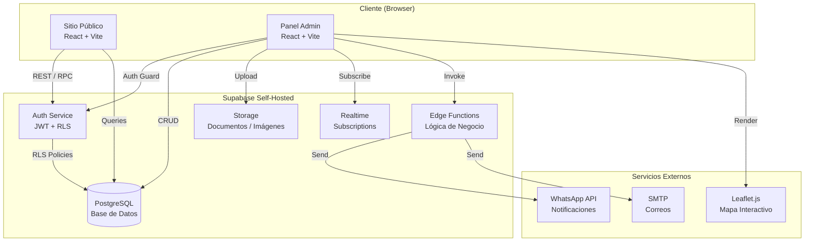
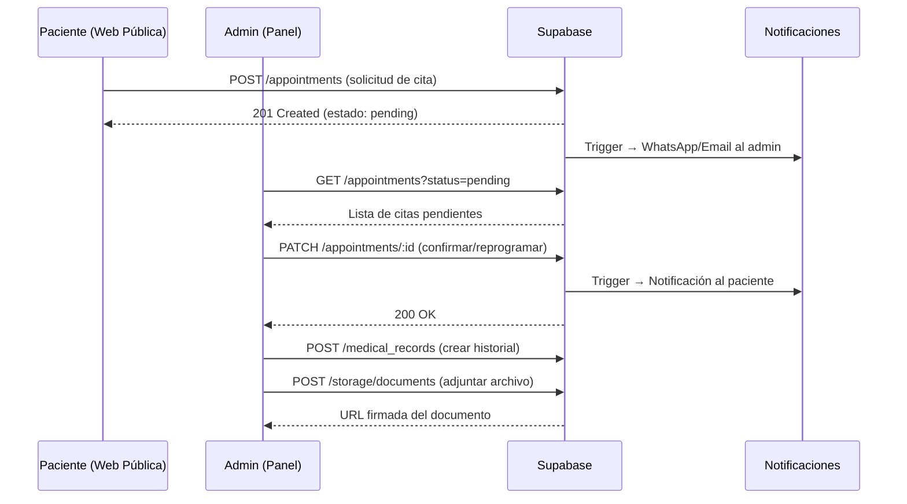
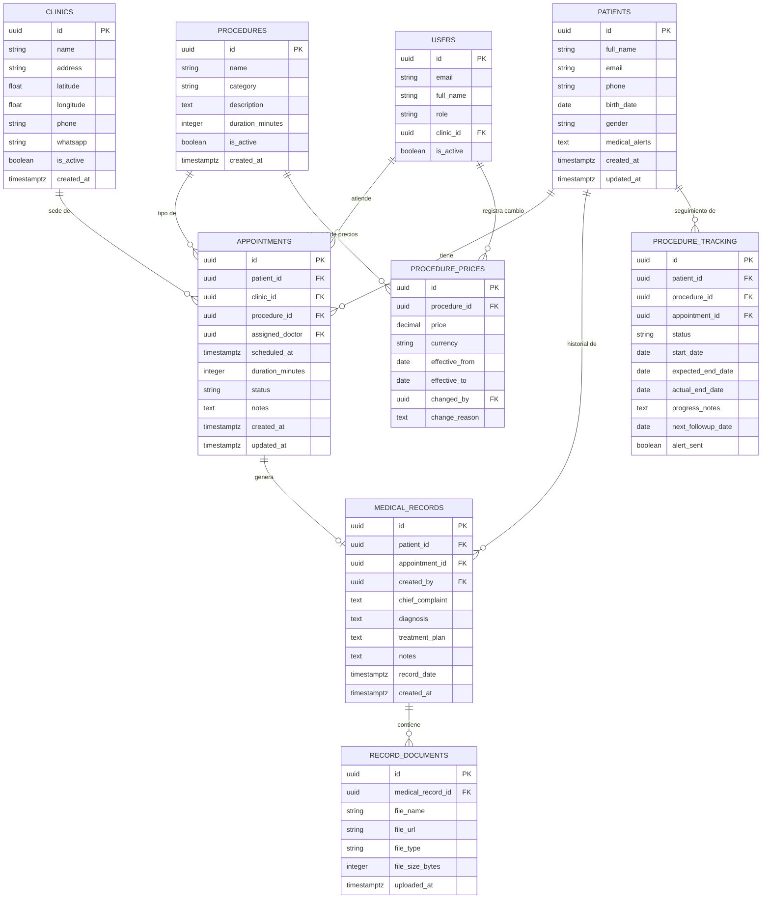

# Documento de Diseño: Sistema de Gestión de Práctica Dental (Dra. Garcia)

## Overview

El sistema migra el sitio web estático de la Dra. Garcia (Periodoncia e Implantes) a una arquitectura full-stack moderna basada en React + Vite en el frontend y Supabase self-hosted en el backend. Además del sitio público existente, se incorpora un panel administrativo completo para gestión de citas, historiales médicos, procedimientos, precios y operaciones multi-clínica con mapa interactivo.

El sistema preserva fielmente la identidad visual existente (paleta cream/gold/navy, tipografías Alex Brush, Montserrat y Playfair Display) mientras añade capacidades de gestión clínica de nivel profesional.

---

## Arquitectura del Sistema (High-Level Design)

### Diagrama de Componentes



### Diagrama de Flujo de Datos Principal




---

## Módulos del Sistema

### 1. Sitio Público (Migración del HTML existente)

**Propósito**: Preservar fielmente el sitio actual en React con las mismas secciones y diseño visual.

**Componentes**:
- `Navbar` — Barra de navegación sticky con logo firma y botón "Reservar Cita"
- `HeroSection` — Sección principal con arco clínico y foto de la doctora
- `AboutSection` — Sección "Sobre Mí" con filosofía
- `ServicesSection` — Tarjetas de especialización (6 áreas)
- `BeforeAfterSlider` — Deslizador interactivo antes/después
- `AppointmentForm` — Formulario de reserva conectado a Supabase
- `Footer` — Pie de página con datos de contacto
- `WhatsAppButton` — Botón flotante de WhatsApp

### 2. Panel Administrativo

**Propósito**: Gestión completa de la práctica dental con acceso protegido por autenticación.

**Módulos del panel**:
- `AppointmentsModule` — CRUD completo de citas con calendario
- `PatientsModule` — Gestión de pacientes y sus historiales
- `MedicalRecordsModule` — Historial médico con documentos adjuntos
- `ProceduresModule` — Catálogo de procedimientos médicos
- `PricingModule` — Tabla de precios con historial de cambios
- `ClinicsModule` — Gestión de sedes con mapa interactivo
- `AnalyticsModule` — Dashboard con métricas y carga de trabajo

### 3. Sistema Multi-Clínica con Mapa

**Propósito**: Visualizar y gestionar múltiples sedes clínicas geográficamente.

**Responsabilidades**:
- Renderizar mapa con marcadores por sede (Leaflet.js)
- Filtrar citas por clínica seleccionada
- Mostrar carga de trabajo por ubicación (citas activas / capacidad)
- Asignar/reasignar citas entre sedes


---

## Modelo de Datos (Diagrama Entidad-Relación)




---

## Low-Level Design

### Estructura de Carpetas del Proyecto

```
dental-practice-management-system/
├── public/
│   └── img/
│       └── doctora_garcia.jpg
├── src/
│   ├── assets/                        # Fuentes, íconos, imágenes estáticas
│   ├── components/
│   │   ├── public/                    # Componentes del sitio público
│   │   │   ├── Navbar.tsx
│   │   │   ├── HeroSection.tsx
│   │   │   ├── AboutSection.tsx
│   │   │   ├── ServicesSection.tsx
│   │   │   ├── BeforeAfterSlider.tsx
│   │   │   ├── AppointmentForm.tsx
│   │   │   ├── Footer.tsx
│   │   │   └── WhatsAppButton.tsx
│   │   ├── admin/                     # Componentes del panel admin
│   │   │   ├── layout/
│   │   │   │   ├── AdminLayout.tsx
│   │   │   │   ├── Sidebar.tsx
│   │   │   │   └── TopBar.tsx
│   │   │   ├── appointments/
│   │   │   │   ├── AppointmentCalendar.tsx
│   │   │   │   ├── AppointmentForm.tsx
│   │   │   │   ├── AppointmentCard.tsx
│   │   │   │   └── AppointmentFilters.tsx
│   │   │   ├── patients/
│   │   │   │   ├── PatientList.tsx
│   │   │   │   ├── PatientForm.tsx
│   │   │   │   └── PatientCard.tsx
│   │   │   ├── medical-records/
│   │   │   │   ├── MedicalRecordView.tsx
│   │   │   │   ├── MedicalRecordForm.tsx
│   │   │   │   └── DocumentUploader.tsx
│   │   │   ├── procedures/
│   │   │   │   ├── ProcedureList.tsx
│   │   │   │   ├── ProcedureForm.tsx
│   │   │   │   └── ProcedureTracking.tsx
│   │   │   ├── pricing/
│   │   │   │   ├── PricingTable.tsx
│   │   │   │   ├── PriceHistoryModal.tsx
│   │   │   │   └── PriceUpdateForm.tsx
│   │   │   ├── clinics/
│   │   │   │   ├── ClinicMap.tsx
│   │   │   │   ├── ClinicCard.tsx
│   │   │   │   └── ClinicWorkloadChart.tsx
│   │   │   └── dashboard/
│   │   │       ├── StatsCards.tsx
│   │   │       ├── AppointmentsChart.tsx
│   │   │       └── AlertsPanel.tsx
│   │   └── ui/                        # Componentes reutilizables de UI
│   │       ├── Button.tsx
│   │       ├── Input.tsx
│   │       ├── Modal.tsx
│   │       ├── Badge.tsx
│   │       └── Table.tsx
│   ├── hooks/                         # Custom React hooks
│   │   ├── useAppointments.ts
│   │   ├── usePatients.ts
│   │   ├── useMedicalRecords.ts
│   │   ├── useProcedures.ts
│   │   ├── useClinics.ts
│   │   └── useAuth.ts
│   ├── lib/
│   │   ├── supabase.ts                # Cliente Supabase configurado
│   │   └── utils.ts                  # Utilidades generales
│   ├── pages/
│   │   ├── public/
│   │   │   └── HomePage.tsx
│   │   └── admin/
│   │       ├── LoginPage.tsx
│   │       ├── DashboardPage.tsx
│   │       ├── AppointmentsPage.tsx
│   │       ├── PatientsPage.tsx
│   │       ├── MedicalRecordsPage.tsx
│   │       ├── ProceduresPage.tsx
│   │       ├── PricingPage.tsx
│   │       └── ClinicsPage.tsx
│   ├── routes/
│   │   ├── PublicRoutes.tsx
│   │   ├── AdminRoutes.tsx
│   │   └── ProtectedRoute.tsx
│   ├── store/                         # Estado global (Zustand)
│   │   ├── authStore.ts
│   │   ├── appointmentStore.ts
│   │   └── clinicStore.ts
│   ├── types/
│   │   └── index.ts                  # Todos los tipos TypeScript
│   ├── App.tsx
│   ├── main.tsx
│   └── index.css
├── supabase/
│   ├── migrations/                    # Migraciones SQL
│   │   ├── 001_create_clinics.sql
│   │   ├── 002_create_patients.sql
│   │   ├── 003_create_procedures.sql
│   │   ├── 004_create_appointments.sql
│   │   ├── 005_create_medical_records.sql
│   │   ├── 006_create_procedure_tracking.sql
│   │   └── 007_rls_policies.sql
│   └── functions/                     # Edge Functions
│       ├── send-appointment-notification/
│       └── generate-patient-report/
├── .env.local
├── tailwind.config.ts
├── vite.config.ts
├── tsconfig.json
└── package.json
```


---

### Interfaces y Tipos TypeScript Principales

```typescript
// src/types/index.ts

// ─── Enumeraciones ───────────────────────────────────────────────────────────

export type AppointmentStatus =
  | 'pending'
  | 'confirmed'
  | 'in_progress'
  | 'completed'
  | 'cancelled'
  | 'rescheduled'

export type ProcedureTrackingStatus =
  | 'scheduled'
  | 'in_progress'
  | 'completed'
  | 'on_hold'
  | 'cancelled'

export type UserRole = 'admin' | 'doctor' | 'receptionist'

export type Gender = 'male' | 'female' | 'other' | 'prefer_not_to_say'

// ─── Entidades de Base de Datos ──────────────────────────────────────────────

export interface Clinic {
  id: string
  name: string
  address: string
  latitude: number
  longitude: number
  phone: string
  whatsapp: string
  is_active: boolean
  created_at: string
}

export interface Patient {
  id: string
  full_name: string
  email: string | null
  phone: string
  birth_date: string | null
  gender: Gender | null
  medical_alerts: string | null
  created_at: string
  updated_at: string
}

export interface Procedure {
  id: string
  name: string
  category: string
  description: string | null
  duration_minutes: number
  is_active: boolean
  created_at: string
  current_price?: ProcedurePrice
}

export interface ProcedurePrice {
  id: string
  procedure_id: string
  price: number
  currency: string
  effective_from: string
  effective_to: string | null
  changed_by: string
  change_reason: string | null
}

export interface Appointment {
  id: string
  patient_id: string
  clinic_id: string
  procedure_id: string
  assigned_doctor: string | null
  scheduled_at: string
  duration_minutes: number
  status: AppointmentStatus
  notes: string | null
  created_at: string
  updated_at: string
  // Relaciones expandidas
  patient?: Patient
  clinic?: Clinic
  procedure?: Procedure
}

export interface MedicalRecord {
  id: string
  patient_id: string
  appointment_id: string | null
  created_by: string
  chief_complaint: string
  diagnosis: string | null
  treatment_plan: string | null
  notes: string | null
  record_date: string
  created_at: string
  documents?: RecordDocument[]
}

export interface RecordDocument {
  id: string
  medical_record_id: string
  file_name: string
  file_url: string
  file_type: string
  file_size_bytes: number
  uploaded_at: string
}

export interface ProcedureTracking {
  id: string
  patient_id: string
  procedure_id: string
  appointment_id: string | null
  status: ProcedureTrackingStatus
  start_date: string
  expected_end_date: string | null
  actual_end_date: string | null
  progress_notes: string | null
  next_followup_date: string | null
  alert_sent: boolean
  patient?: Patient
  procedure?: Procedure
}

export interface User {
  id: string
  email: string
  full_name: string
  role: UserRole
  clinic_id: string | null
  is_active: boolean
}

// ─── DTOs (Data Transfer Objects) ────────────────────────────────────────────

export interface CreateAppointmentDTO {
  patient_id: string
  clinic_id: string
  procedure_id: string
  scheduled_at: string
  duration_minutes?: number
  notes?: string
}

export interface PublicAppointmentRequestDTO {
  full_name: string
  phone: string
  service: string
  preferred_date: string
  preferred_time_slot: 'morning' | 'afternoon'
  clinic_id?: string
}

export interface UpdateAppointmentDTO {
  status?: AppointmentStatus
  scheduled_at?: string
  notes?: string
  assigned_doctor?: string
}

export interface CreateMedicalRecordDTO {
  patient_id: string
  appointment_id?: string
  chief_complaint: string
  diagnosis?: string
  treatment_plan?: string
  notes?: string
  record_date: string
}

export interface UpdatePriceDTO {
  procedure_id: string
  price: number
  currency: string
  effective_from: string
  change_reason: string
}

// ─── Tipos de UI ─────────────────────────────────────────────────────────────

export interface ClinicWorkload {
  clinic: Clinic
  total_appointments: number
  pending_appointments: number
  confirmed_appointments: number
  capacity_percentage: number
}

export interface DashboardStats {
  total_appointments_today: number
  pending_confirmations: number
  active_procedures: number
  upcoming_followups: number
  appointments_by_clinic: ClinicWorkload[]
}

export interface CalendarEvent {
  id: string
  title: string
  start: Date
  end: Date
  status: AppointmentStatus
  patient_name: string
  clinic_name: string
  color: string
}
```


---

### Esquemas SQL de Base de Datos (Supabase / PostgreSQL)

```sql
-- 001_create_clinics.sql
CREATE TABLE clinics (
  id          UUID PRIMARY KEY DEFAULT gen_random_uuid(),
  name        TEXT NOT NULL,
  address     TEXT NOT NULL,
  latitude    DOUBLE PRECISION NOT NULL,
  longitude   DOUBLE PRECISION NOT NULL,
  phone       TEXT,
  whatsapp    TEXT,
  is_active   BOOLEAN NOT NULL DEFAULT true,
  created_at  TIMESTAMPTZ NOT NULL DEFAULT now()
);

-- 002_create_patients.sql
CREATE TABLE patients (
  id              UUID PRIMARY KEY DEFAULT gen_random_uuid(),
  full_name       TEXT NOT NULL,
  email           TEXT UNIQUE,
  phone           TEXT NOT NULL,
  birth_date      DATE,
  gender          TEXT CHECK (gender IN ('male','female','other','prefer_not_to_say')),
  medical_alerts  TEXT,
  created_at      TIMESTAMPTZ NOT NULL DEFAULT now(),
  updated_at      TIMESTAMPTZ NOT NULL DEFAULT now()
);

-- 003_create_procedures.sql
CREATE TABLE procedures (
  id                UUID PRIMARY KEY DEFAULT gen_random_uuid(),
  name              TEXT NOT NULL,
  category          TEXT NOT NULL,
  description       TEXT,
  duration_minutes  INTEGER NOT NULL DEFAULT 60,
  is_active         BOOLEAN NOT NULL DEFAULT true,
  created_at        TIMESTAMPTZ NOT NULL DEFAULT now()
);

CREATE TABLE procedure_prices (
  id              UUID PRIMARY KEY DEFAULT gen_random_uuid(),
  procedure_id    UUID NOT NULL REFERENCES procedures(id) ON DELETE CASCADE,
  price           NUMERIC(10,2) NOT NULL,
  currency        TEXT NOT NULL DEFAULT 'DOP',
  effective_from  DATE NOT NULL,
  effective_to    DATE,
  changed_by      UUID REFERENCES auth.users(id),
  change_reason   TEXT,
  CONSTRAINT no_overlapping_prices EXCLUDE USING gist (
    procedure_id WITH =,
    daterange(effective_from, effective_to, '[)') WITH &&
  )
);

-- 004_create_appointments.sql
CREATE TABLE appointments (
  id                UUID PRIMARY KEY DEFAULT gen_random_uuid(),
  patient_id        UUID NOT NULL REFERENCES patients(id),
  clinic_id         UUID NOT NULL REFERENCES clinics(id),
  procedure_id      UUID REFERENCES procedures(id),
  assigned_doctor   UUID REFERENCES auth.users(id),
  scheduled_at      TIMESTAMPTZ NOT NULL,
  duration_minutes  INTEGER NOT NULL DEFAULT 60,
  status            TEXT NOT NULL DEFAULT 'pending'
                    CHECK (status IN ('pending','confirmed','in_progress',
                                      'completed','cancelled','rescheduled')),
  notes             TEXT,
  created_at        TIMESTAMPTZ NOT NULL DEFAULT now(),
  updated_at        TIMESTAMPTZ NOT NULL DEFAULT now()
);

CREATE INDEX idx_appointments_scheduled_at ON appointments(scheduled_at);
CREATE INDEX idx_appointments_patient_id   ON appointments(patient_id);
CREATE INDEX idx_appointments_clinic_id    ON appointments(clinic_id);
CREATE INDEX idx_appointments_status       ON appointments(status);

-- 005_create_medical_records.sql
CREATE TABLE medical_records (
  id              UUID PRIMARY KEY DEFAULT gen_random_uuid(),
  patient_id      UUID NOT NULL REFERENCES patients(id),
  appointment_id  UUID REFERENCES appointments(id),
  created_by      UUID NOT NULL REFERENCES auth.users(id),
  chief_complaint TEXT NOT NULL,
  diagnosis       TEXT,
  treatment_plan  TEXT,
  notes           TEXT,
  record_date     TIMESTAMPTZ NOT NULL DEFAULT now(),
  created_at      TIMESTAMPTZ NOT NULL DEFAULT now()
);

CREATE TABLE record_documents (
  id                UUID PRIMARY KEY DEFAULT gen_random_uuid(),
  medical_record_id UUID NOT NULL REFERENCES medical_records(id) ON DELETE CASCADE,
  file_name         TEXT NOT NULL,
  file_url          TEXT NOT NULL,
  file_type         TEXT NOT NULL,
  file_size_bytes   INTEGER,
  uploaded_at       TIMESTAMPTZ NOT NULL DEFAULT now()
);

-- 006_create_procedure_tracking.sql
CREATE TABLE procedure_tracking (
  id                  UUID PRIMARY KEY DEFAULT gen_random_uuid(),
  patient_id          UUID NOT NULL REFERENCES patients(id),
  procedure_id        UUID NOT NULL REFERENCES procedures(id),
  appointment_id      UUID REFERENCES appointments(id),
  status              TEXT NOT NULL DEFAULT 'scheduled'
                      CHECK (status IN ('scheduled','in_progress','completed',
                                        'on_hold','cancelled')),
  start_date          DATE NOT NULL,
  expected_end_date   DATE,
  actual_end_date     DATE,
  progress_notes      TEXT,
  next_followup_date  DATE,
  alert_sent          BOOLEAN NOT NULL DEFAULT false
);

CREATE INDEX idx_tracking_next_followup ON procedure_tracking(next_followup_date)
  WHERE status NOT IN ('completed','cancelled');
```


---

### Políticas de Seguridad Row-Level Security (RLS)

```sql
-- 007_rls_policies.sql

-- Habilitar RLS en todas las tablas
ALTER TABLE clinics            ENABLE ROW LEVEL SECURITY;
ALTER TABLE patients           ENABLE ROW LEVEL SECURITY;
ALTER TABLE appointments       ENABLE ROW LEVEL SECURITY;
ALTER TABLE medical_records    ENABLE ROW LEVEL SECURITY;
ALTER TABLE record_documents   ENABLE ROW LEVEL SECURITY;
ALTER TABLE procedures         ENABLE ROW LEVEL SECURITY;
ALTER TABLE procedure_prices   ENABLE ROW LEVEL SECURITY;
ALTER TABLE procedure_tracking ENABLE ROW LEVEL SECURITY;

-- Función auxiliar para obtener el rol del usuario autenticado
CREATE OR REPLACE FUNCTION get_user_role()
RETURNS TEXT AS $$
  SELECT role FROM public.users WHERE id = auth.uid()
$$ LANGUAGE sql SECURITY DEFINER;

-- Función auxiliar para obtener la clínica del usuario
CREATE OR REPLACE FUNCTION get_user_clinic_id()
RETURNS UUID AS $$
  SELECT clinic_id FROM public.users WHERE id = auth.uid()
$$ LANGUAGE sql SECURITY DEFINER;

-- Clínicas: lectura pública, escritura solo admin
CREATE POLICY "clinics_public_read"  ON clinics FOR SELECT USING (true);
CREATE POLICY "clinics_admin_write"  ON clinics FOR ALL
  USING (get_user_role() = 'admin');

-- Pacientes: solo usuarios autenticados
CREATE POLICY "patients_auth_read"   ON patients FOR SELECT
  USING (auth.role() = 'authenticated');
CREATE POLICY "patients_auth_write"  ON patients FOR ALL
  USING (auth.role() = 'authenticated');

-- Citas: admin ve todo, doctor/recepcionista ve su clínica
CREATE POLICY "appointments_admin_all" ON appointments FOR ALL
  USING (get_user_role() = 'admin');
CREATE POLICY "appointments_clinic_read" ON appointments FOR SELECT
  USING (
    get_user_role() IN ('doctor','receptionist')
    AND clinic_id = get_user_clinic_id()
  );

-- Historial médico: solo autenticados
CREATE POLICY "records_auth_all" ON medical_records FOR ALL
  USING (auth.role() = 'authenticated');

-- Procedimientos: lectura pública (para el formulario web), escritura admin
CREATE POLICY "procedures_public_read" ON procedures FOR SELECT USING (true);
CREATE POLICY "procedures_admin_write" ON procedures FOR ALL
  USING (get_user_role() = 'admin');

-- Precios: lectura autenticada, escritura admin
CREATE POLICY "prices_auth_read"   ON procedure_prices FOR SELECT
  USING (auth.role() = 'authenticated');
CREATE POLICY "prices_admin_write" ON procedure_prices FOR ALL
  USING (get_user_role() = 'admin');
```


---

### Firmas de Funciones y Hooks Clave

```typescript
// ─── lib/supabase.ts ──────────────────────────────────────────────────────────

import { createClient } from '@supabase/supabase-js'
import type { Database } from './database.types'

export const supabase = createClient<Database>(
  import.meta.env.VITE_SUPABASE_URL,
  import.meta.env.VITE_SUPABASE_ANON_KEY
)

// ─── hooks/useAppointments.ts ─────────────────────────────────────────────────

interface UseAppointmentsOptions {
  clinicId?: string
  status?: AppointmentStatus
  dateFrom?: string
  dateTo?: string
}

interface UseAppointmentsReturn {
  appointments: Appointment[]
  isLoading: boolean
  error: Error | null
  createAppointment: (dto: CreateAppointmentDTO) => Promise<Appointment>
  updateAppointment: (id: string, dto: UpdateAppointmentDTO) => Promise<Appointment>
  cancelAppointment: (id: string, reason?: string) => Promise<void>
  rescheduleAppointment: (id: string, newDate: string) => Promise<Appointment>
  refetch: () => void
}

export function useAppointments(options?: UseAppointmentsOptions): UseAppointmentsReturn

// ─── hooks/usePatients.ts ─────────────────────────────────────────────────────

interface UsePatientReturn {
  patient: Patient | null
  medicalRecords: MedicalRecord[]
  procedureTracking: ProcedureTracking[]
  appointments: Appointment[]
  isLoading: boolean
  updatePatient: (dto: Partial<Patient>) => Promise<Patient>
}

export function usePatient(patientId: string): UsePatientReturn

interface UsePatientsReturn {
  patients: Patient[]
  isLoading: boolean
  searchPatients: (query: string) => Promise<Patient[]>
  createPatient: (dto: Omit<Patient, 'id' | 'created_at' | 'updated_at'>) => Promise<Patient>
}

export function usePatients(): UsePatientsReturn

// ─── hooks/useMedicalRecords.ts ───────────────────────────────────────────────

interface UseMedicalRecordsReturn {
  records: MedicalRecord[]
  isLoading: boolean
  createRecord: (dto: CreateMedicalRecordDTO) => Promise<MedicalRecord>
  updateRecord: (id: string, dto: Partial<MedicalRecord>) => Promise<MedicalRecord>
  uploadDocument: (recordId: string, file: File) => Promise<RecordDocument>
  deleteDocument: (documentId: string) => Promise<void>
}

export function useMedicalRecords(patientId: string): UseMedicalRecordsReturn

// ─── hooks/useClinics.ts ──────────────────────────────────────────────────────

interface UseClinicsReturn {
  clinics: Clinic[]
  workloads: ClinicWorkload[]
  isLoading: boolean
  getClinicWorkload: (clinicId: string, date: string) => Promise<ClinicWorkload>
  reassignAppointment: (appointmentId: string, targetClinicId: string) => Promise<void>
}

export function useClinics(): UseClinicsReturn

// ─── hooks/usePricing.ts ──────────────────────────────────────────────────────

interface UsePricingReturn {
  currentPrices: (Procedure & { current_price: ProcedurePrice })[]
  isLoading: boolean
  updatePrice: (dto: UpdatePriceDTO) => Promise<ProcedurePrice>
  getPriceHistory: (procedureId: string) => Promise<ProcedurePrice[]>
}

export function usePricing(): UsePricingReturn

// ─── hooks/useAuth.ts ─────────────────────────────────────────────────────────

interface UseAuthReturn {
  user: User | null
  session: Session | null
  isLoading: boolean
  isAdmin: boolean
  signIn: (email: string, password: string) => Promise<void>
  signOut: () => Promise<void>
}

export function useAuth(): UseAuthReturn
```


---

### Algoritmos Clave con Especificaciones Formales

#### Algoritmo: Verificación de Disponibilidad de Cita

```typescript
/**
 * Verifica si un slot de tiempo está disponible en una clínica.
 *
 * Precondiciones:
 *   - clinicId es un UUID válido y existente
 *   - scheduledAt es una fecha futura (> now())
 *   - durationMinutes > 0
 *
 * Postcondiciones:
 *   - Retorna true si y solo si no existe ninguna cita confirmada/en_progreso
 *     en la clínica que se solape con el intervalo [scheduledAt, scheduledAt + duration]
 *   - No produce efectos secundarios en la base de datos
 *
 * Invariante de bucle:
 *   - Para cada cita existente revisada, el intervalo de solapamiento
 *     se calcula correctamente como: start < newEnd AND end > newStart
 */
async function checkSlotAvailability(
  clinicId: string,
  scheduledAt: Date,
  durationMinutes: number
): Promise<boolean> {
  const newStart = scheduledAt
  const newEnd = new Date(scheduledAt.getTime() + durationMinutes * 60_000)

  const { data: conflicts } = await supabase
    .from('appointments')
    .select('id, scheduled_at, duration_minutes')
    .eq('clinic_id', clinicId)
    .in('status', ['confirmed', 'in_progress'])
    .lt('scheduled_at', newEnd.toISOString())
    .gt('scheduled_at', new Date(newStart.getTime() - 24 * 60 * 60_000).toISOString())

  if (!conflicts) return true

  return !conflicts.some(appt => {
    const existingStart = new Date(appt.scheduled_at)
    const existingEnd = new Date(
      existingStart.getTime() + appt.duration_minutes * 60_000
    )
    // Solapamiento: los intervalos se cruzan si start1 < end2 AND end1 > start2
    return newStart < existingEnd && newEnd > existingStart
  })
}
```

#### Algoritmo: Generación de Alertas de Seguimiento

```typescript
/**
 * Identifica procedimientos con seguimiento vencido o próximo a vencer.
 *
 * Precondiciones:
 *   - daysAhead >= 0
 *
 * Postcondiciones:
 *   - Retorna todos los ProcedureTracking donde:
 *     next_followup_date <= (today + daysAhead) AND
 *     status NOT IN ('completed', 'cancelled') AND
 *     alert_sent = false
 *   - Marca alert_sent = true en los registros retornados
 *
 * Invariante de bucle:
 *   - Todos los registros procesados previamente tienen alert_sent = true
 */
async function generateFollowupAlerts(daysAhead: number = 3): Promise<ProcedureTracking[]> {
  const cutoffDate = new Date()
  cutoffDate.setDate(cutoffDate.getDate() + daysAhead)

  const { data: dueTrackings } = await supabase
    .from('procedure_tracking')
    .select('*, patient:patients(*), procedure:procedures(*)')
    .lte('next_followup_date', cutoffDate.toISOString().split('T')[0])
    .not('status', 'in', '("completed","cancelled")')
    .eq('alert_sent', false)

  if (!dueTrackings?.length) return []

  // Marcar como alertados
  const ids = dueTrackings.map(t => t.id)
  await supabase
    .from('procedure_tracking')
    .update({ alert_sent: true })
    .in('id', ids)

  return dueTrackings as ProcedureTracking[]
}
```

#### Algoritmo: Cálculo de Carga de Trabajo por Clínica

```typescript
/**
 * Calcula la carga de trabajo de cada clínica para una fecha dada.
 *
 * Precondiciones:
 *   - date es una fecha válida en formato ISO (YYYY-MM-DD)
 *   - DAILY_CAPACITY > 0 (constante de configuración)
 *
 * Postcondiciones:
 *   - Para cada clínica activa, retorna un ClinicWorkload con:
 *     capacity_percentage = (confirmed + in_progress) / DAILY_CAPACITY * 100
 *     capacity_percentage está en el rango [0, 100] (clamped)
 *
 * Invariante de bucle:
 *   - Cada clínica procesada tiene su conteo calculado correctamente
 *     antes de pasar a la siguiente
 */
async function calculateClinicWorkloads(
  date: string,
  dailyCapacity: number = 20
): Promise<ClinicWorkload[]> {
  const dayStart = `${date}T00:00:00Z`
  const dayEnd   = `${date}T23:59:59Z`

  const { data: clinics } = await supabase
    .from('clinics')
    .select('*')
    .eq('is_active', true)

  if (!clinics) return []

  const workloads: ClinicWorkload[] = []

  for (const clinic of clinics) {
    const { count: total } = await supabase
      .from('appointments')
      .select('*', { count: 'exact', head: true })
      .eq('clinic_id', clinic.id)
      .gte('scheduled_at', dayStart)
      .lte('scheduled_at', dayEnd)

    const { count: pending } = await supabase
      .from('appointments')
      .select('*', { count: 'exact', head: true })
      .eq('clinic_id', clinic.id)
      .eq('status', 'pending')
      .gte('scheduled_at', dayStart)
      .lte('scheduled_at', dayEnd)

    const { count: confirmed } = await supabase
      .from('appointments')
      .select('*', { count: 'exact', head: true })
      .eq('clinic_id', clinic.id)
      .in('status', ['confirmed', 'in_progress'])
      .gte('scheduled_at', dayStart)
      .lte('scheduled_at', dayEnd)

    workloads.push({
      clinic,
      total_appointments: total ?? 0,
      pending_appointments: pending ?? 0,
      confirmed_appointments: confirmed ?? 0,
      capacity_percentage: Math.min(
        Math.round(((confirmed ?? 0) / dailyCapacity) * 100),
        100
      ),
    })
  }

  return workloads
}
```


---

### Estructura de Componentes React Clave

#### Componente: ClinicMap

```typescript
// src/components/admin/clinics/ClinicMap.tsx

interface ClinicMapProps {
  clinics: Clinic[]
  workloads: ClinicWorkload[]
  selectedClinicId?: string
  onClinicSelect: (clinicId: string) => void
  onAppointmentDrop?: (appointmentId: string, targetClinicId: string) => void
}

/**
 * Renderiza un mapa interactivo con Leaflet.js mostrando todas las sedes.
 * Cada marcador muestra el nombre de la clínica y su carga de trabajo.
 * El color del marcador varía según capacity_percentage:
 *   - Verde:   0–50%
 *   - Amarillo: 51–80%
 *   - Rojo:    81–100%
 */
export const ClinicMap: React.FC<ClinicMapProps>
```

#### Componente: AppointmentCalendar

```typescript
// src/components/admin/appointments/AppointmentCalendar.tsx

interface AppointmentCalendarProps {
  events: CalendarEvent[]
  clinicFilter?: string
  onEventClick: (appointmentId: string) => void
  onSlotSelect: (start: Date, end: Date) => void
  view?: 'month' | 'week' | 'day' | 'agenda'
}

/**
 * Calendario de citas basado en react-big-calendar.
 * Soporta vistas: mes, semana, día y agenda.
 * Los eventos se colorean según el status de la cita.
 * Permite crear nuevas citas haciendo clic en un slot vacío.
 */
export const AppointmentCalendar: React.FC<AppointmentCalendarProps>
```

#### Componente: MedicalRecordView

```typescript
// src/components/admin/medical-records/MedicalRecordView.tsx

interface MedicalRecordViewProps {
  patientId: string
  onAddRecord: () => void
}

/**
 * Vista completa del historial médico de un paciente.
 * Muestra registros en orden cronológico descendente.
 * Permite expandir cada registro para ver detalles y documentos adjuntos.
 * Soporta descarga de documentos mediante URLs firmadas de Supabase Storage.
 */
export const MedicalRecordView: React.FC<MedicalRecordViewProps>
```

#### Componente: ProcedureTracking

```typescript
// src/components/admin/procedures/ProcedureTracking.tsx

interface ProcedureTrackingProps {
  patientId?: string          // Si se provee, filtra por paciente
  showAlertsOnly?: boolean    // Si true, muestra solo los que requieren seguimiento
  onUpdateStatus: (trackingId: string, status: ProcedureTrackingStatus) => void
}

/**
 * Panel de seguimiento de procedimientos en curso y programados.
 * Muestra una línea de tiempo visual del progreso de cada procedimiento.
 * Resalta en rojo los procedimientos con next_followup_date vencida.
 * Resalta en amarillo los que vencen en los próximos 3 días.
 */
export const ProcedureTrackingPanel: React.FC<ProcedureTrackingProps>
```


---

## Manejo de Errores

### Escenario 1: Conflicto de Horario en Cita

**Condición**: Se intenta crear una cita en un slot ya ocupado en la misma clínica.
**Respuesta**: HTTP 409 Conflict con mensaje descriptivo indicando el horario disponible más próximo.
**Recuperación**: El frontend muestra un selector de horarios alternativos disponibles.

### Escenario 2: Fallo en Carga de Documento

**Condición**: El archivo supera el límite de tamaño (50MB) o tiene un tipo no permitido.
**Respuesta**: Error de validación en el cliente antes de intentar el upload.
**Recuperación**: Mensaje de error con los tipos y tamaños permitidos. El registro médico se guarda sin el documento.

### Escenario 3: Sesión Expirada en Panel Admin

**Condición**: El token JWT del usuario expira durante una sesión activa.
**Respuesta**: Supabase retorna 401. El cliente intercepta el error y redirige al login.
**Recuperación**: Después del re-login, se restaura la última ruta visitada.

### Escenario 4: Clínica Sin Coordenadas Válidas

**Condición**: Una clínica tiene coordenadas nulas o fuera de rango al renderizar el mapa.
**Respuesta**: El marcador de esa clínica se omite del mapa con un warning en consola.
**Recuperación**: Se muestra un banner en el panel indicando que la clínica necesita actualizar su ubicación.

---

## Correctness Properties

*Una propiedad es una característica o comportamiento que debe mantenerse verdadero en todas las ejecuciones válidas del sistema — esencialmente, una declaración formal sobre lo que el sistema debe hacer. Las propiedades sirven como puente entre las especificaciones legibles por humanos y las garantías de corrección verificables por máquinas.*

### Property 1: Formulario público rechaza entradas inválidas

*Para cualquier* combinación de campos del AppointmentForm donde al menos un campo requerido esté vacío o tenga formato inválido, el sistema SHALL rechazar el envío y SHALL mostrar mensajes de error por campo, sin crear ningún registro en la DB.

**Validates: Requirements 2.4**

### Property 2: Creación de cita pública genera estado pending

*Para cualquier* conjunto de datos válidos enviados desde el AppointmentForm (nombre, teléfono, servicio, fecha, franja horaria), el sistema SHALL crear exactamente un registro de cita con estado `pending` en la DB.

**Validates: Requirements 2.2**

### Property 3: Credenciales inválidas son rechazadas

*Para cualquier* par (email, contraseña) que no corresponda a un usuario registrado y activo, el Auth_Service SHALL rechazar el acceso sin revelar si el email o la contraseña son incorrectos.

**Validates: Requirements 3.3**

### Property 4: RLS restringe acceso por rol y clínica

*Para cualquier* usuario con rol `doctor` o `recepcionista`, todas las consultas a las tablas `appointments`, `patients`, `medical_records` y `procedure_tracking` SHALL retornar únicamente registros asociados a la clínica asignada a ese usuario, y cualquier intento de acceder a datos de otra clínica SHALL ser denegado con HTTP 403.

**Validates: Requirements 3.7, 3.8, 6.7, 17.3**

### Property 5: Rutas del panel admin requieren autenticación

*Para cualquier* ruta del Panel_Admin accedida sin una sesión JWT válida, el sistema SHALL redirigir al usuario a la página de login, preservando la ruta original como destino post-login.

**Validates: Requirements 3.9**

### Property 6: Coloreado de eventos del calendario según estado

*Para cualquier* cita con cualquier estado válido (`pending`, `confirmed`, `in_progress`, `completed`, `cancelled`, `rescheduled`), el Appointment_Module SHALL asignar un color de evento distinto y consistente que corresponda a ese estado.

**Validates: Requirements 4.2**

### Property 7: Transiciones de estado de citas son consistentes

*Para cualquier* cita existente, cuando se aplica una acción de confirmación, reprogramación o cancelación, el estado resultante en la DB SHALL ser exactamente `confirmed`, `rescheduled` o `cancelled` respectivamente, y el estado anterior SHALL quedar registrado en el historial de actualizaciones.

**Validates: Requirements 4.5, 4.6, 4.7**

### Property 8: Filtrado de citas por clínica, estado y fechas

*Para cualquier* combinación de filtros (clinicId, status, dateFrom, dateTo), todos los resultados retornados por el Appointment_Module SHALL satisfacer simultáneamente todos los filtros aplicados, y ningún resultado que no satisfaga algún filtro SHALL aparecer en la respuesta.

**Validates: Requirements 4.9**

### Property 9: Verificación de disponibilidad de slots sin solapamiento

*Para cualquier* par de intervalos de tiempo `[start1, end1]` y `[start2, end2]` en la misma clínica donde `end1 <= start2` o `end2 <= start1`, el Availability_Checker SHALL retornar `true`. *Para cualquier* par donde `start1 < end2` AND `end1 > start2`, el Availability_Checker SHALL retornar `false`.

**Validates: Requirements 5.1, 5.2, 5.3**

### Property 10: Citas canceladas/reprogramadas no bloquean disponibilidad

*Para cualquier* slot de tiempo que solo tenga citas con estado `cancelled` o `rescheduled`, el Availability_Checker SHALL retornar `true`, independientemente de cuántas citas canceladas/reprogramadas existan en ese slot.

**Validates: Requirements 5.4**

### Property 11: Validación de campos requeridos en creación de paciente

*Para cualquier* intento de crear un paciente sin nombre completo o sin teléfono, el sistema SHALL rechazar la operación con un error de validación, sin crear ningún registro en la DB.

**Validates: Requirements 6.2**

### Property 12: Búsqueda de pacientes retorna coincidencias parciales insensibles a mayúsculas

*Para cualquier* término de búsqueda `q` y cualquier paciente cuyo nombre, teléfono o correo contenga `q` (ignorando mayúsculas/minúsculas), ese paciente SHALL aparecer en los resultados. Ningún paciente que no contenga `q` en ninguno de esos campos SHALL aparecer en los resultados.

**Validates: Requirements 6.3, 6.4**

### Property 13: Correos duplicados son rechazados

*Para cualquier* intento de registrar un paciente con un correo electrónico ya existente en la DB, el sistema SHALL rechazar la operación con un error descriptivo, sin crear un registro duplicado.

**Validates: Requirements 6.6**

### Property 14: Historial médico se muestra en orden cronológico descendente

*Para cualquier* paciente con N registros médicos (N >= 2), el MedicalRecord_Module SHALL retornarlos ordenados de modo que `records[i].record_date >= records[i+1].record_date` para todo i en [0, N-2].

**Validates: Requirements 7.3**

### Property 15: Validación de archivos antes del upload

*Para cualquier* archivo cuyo tamaño supere 50 MB o cuyo tipo MIME no esté en la lista de tipos permitidos, el sistema SHALL rechazar el upload, SHALL mostrar un mensaje de error con los tipos y tamaños permitidos, y SHALL guardar el registro médico sin el documento adjunto.

**Validates: Requirements 7.5, 7.6, 17.6**

### Property 16: Round-trip de documentos médicos (upload → download)

*Para cualquier* documento válido subido al Storage, el sistema SHALL generar una URL firmada que permita descargar el contenido exacto del archivo original, y el contenido descargado SHALL ser idéntico al contenido subido.

**Validates: Requirements 7.8**

### Property 17: Validación de campos requeridos en creación de procedimiento

*Para cualquier* intento de crear un procedimiento sin nombre, categoría o duración en minutos, el sistema SHALL rechazar la operación con un error de validación.

**Validates: Requirements 8.2**

### Property 18: Procedimientos desactivados excluidos de selectores

*Para cualquier* procedimiento con `is_active = false`, ese procedimiento SHALL estar ausente de todos los selectores de procedimientos en el formulario de citas del Panel_Admin y en el AppointmentForm del Sitio_Público.

**Validates: Requirements 8.4**

### Property 19: Actualización de precio preserva historial completo

*Para cualquier* procedimiento con N actualizaciones de precio (N >= 1), el Pricing_Module SHALL retornar exactamente N registros en el historial de precios, cada uno con su precio, moneda, fecha de vigencia, usuario responsable y motivo del cambio.

**Validates: Requirements 9.2, 9.3**

### Property 20: Constraint de no solapamiento de precios

*Para cualquier* par de registros de precio para el mismo procedimiento con rangos de fechas `[from1, to1)` y `[from2, to2)` que se solapen, la DB SHALL rechazar la inserción del segundo registro mediante la constraint `no_overlapping_prices`.

**Validates: Requirements 9.4**

### Property 21: Actualización de precio requiere motivo

*Para cualquier* intento de actualizar el precio de un procedimiento sin proporcionar un motivo de cambio, el sistema SHALL rechazar la operación con un error de validación.

**Validates: Requirements 9.5**

### Property 22: Marcadores del mapa corresponden a clínicas activas con coordenadas válidas

*Para cualquier* conjunto de clínicas activas con coordenadas válidas, el Clinic_Module SHALL renderizar exactamente un marcador por clínica, posicionado en las coordenadas (latitud, longitud) de esa clínica.

**Validates: Requirements 10.2**

### Property 23: Color de marcadores refleja carga de trabajo

*Para cualquier* clínica con `capacity_percentage` en [0, 50], el marcador SHALL ser verde. *Para cualquier* clínica con `capacity_percentage` en (50, 80], el marcador SHALL ser amarillo. *Para cualquier* clínica con `capacity_percentage` en (80, 100], el marcador SHALL ser rojo.

**Validates: Requirements 10.3**

### Property 24: Filtrado de citas por clínica seleccionada en mapa

*Para cualquier* clínica seleccionada en el mapa, todas las citas mostradas en el Appointment_Module SHALL pertenecer exclusivamente a esa clínica, y ninguna cita de otra clínica SHALL aparecer en la vista filtrada.

**Validates: Requirements 10.5**

### Property 25: Sedes desactivadas excluidas del mapa y selectores

*Para cualquier* sede con `is_active = false`, esa sede SHALL estar ausente del mapa interactivo y de todos los selectores de clínica en formularios del sistema.

**Validates: Requirements 10.9**

### Property 26: Workload_Calculator retorna un resultado por clínica activa

*Para cualquier* fecha válida, el Workload_Calculator SHALL retornar exactamente un objeto `ClinicWorkload` por cada clínica con `is_active = true`, sin omitir ninguna clínica activa ni incluir clínicas inactivas.

**Validates: Requirements 11.1**

### Property 27: Fórmula de capacity_percentage es correcta

*Para cualquier* clínica con `C` citas confirmadas/en_progreso y capacidad diaria `D`, el `capacity_percentage` calculado SHALL ser igual a `round(C / D * 100)`.

**Validates: Requirements 11.2**

### Property 28: capacity_percentage siempre está en el rango [0, 100]

*Para cualquier* clínica con cualquier número de citas (incluyendo más citas que la capacidad diaria), el `capacity_percentage` retornado por el Workload_Calculator SHALL ser siempre un valor en el rango cerrado [0, 100].

**Validates: Requirements 11.3**

### Property 29: Workload_Calculator cuenta solo citas del día especificado

*Para cualquier* fecha `D`, el Workload_Calculator SHALL contar únicamente las citas cuyo `scheduled_at` esté en el intervalo `[D 00:00:00 UTC, D 23:59:59 UTC]`, excluyendo citas de días anteriores o posteriores.

**Validates: Requirements 11.4**

### Property 30: Followup_Alert_Generator identifica correctamente los registros pendientes

*Para cualquier* conjunto de registros de `procedure_tracking`, el Followup_Alert_Generator SHALL identificar exactamente aquellos donde `next_followup_date <= (hoy + N días)` AND `status NOT IN ('completed', 'cancelled')` AND `alert_sent = false`, sin incluir registros que no cumplan todos los criterios.

**Validates: Requirements 12.1**

### Property 31: Followup_Alert_Generator es idempotente (no genera alertas duplicadas)

*Para cualquier* ejecución del Followup_Alert_Generator, todos los registros identificados SHALL tener `alert_sent` marcado como `true` después de la ejecución. Una segunda ejecución inmediata SHALL retornar cero registros para los mismos datos, garantizando que no se generen alertas duplicadas.

**Validates: Requirements 12.2**

### Property 32: Notificaciones no interrumpen la operación principal

*Para cualquier* operación de creación o actualización de cita donde el envío de notificación falle (por cualquier causa), la operación principal SHALL completarse exitosamente y el error de notificación SHALL ser registrado en los logs sin propagar la excepción al cliente.

**Validates: Requirements 14.6**

### Property 33: Validación Zod captura entradas inválidas antes de la DB

*Para cualquier* dato de entrada que viole el esquema Zod definido para su tipo (campos requeridos ausentes, tipos incorrectos, valores fuera de rango), el sistema SHALL rechazar la operación en el cliente antes de realizar ninguna llamada a la DB.

**Validates: Requirements 15.1**

### Property 34: Acceso no autorizado retorna HTTP 403

*Para cualquier* intento de un usuario autenticado de acceder o modificar datos que sus políticas RLS no permiten, la DB SHALL denegar la operación y el sistema SHALL retornar HTTP 403 al cliente.

**Validates: Requirements 15.4, 17.3**

### Property 35: Paginación cursor-based en todas las listas

*Para cualquier* consulta de lista (pacientes, citas, historiales, procedimientos) con un parámetro de paginación válido, el sistema SHALL retornar exactamente el número de registros solicitado (o menos si no hay suficientes), junto con un cursor para la siguiente página.

**Validates: Requirements 16.1**

---

## Estrategia de Testing

### Testing Unitario

- **Framework**: Vitest + React Testing Library
- **Cobertura objetivo**: 80% en hooks y funciones de utilidad
- **Casos clave**:
  - `checkSlotAvailability`: casos de solapamiento exacto, parcial y sin solapamiento
  - `generateFollowupAlerts`: fechas límite, registros ya alertados, sin registros
  - `calculateClinicWorkloads`: clínica vacía, clínica al 100%, múltiples clínicas

### Testing de Propiedades (Property-Based Testing)

- **Librería**: fast-check
- **Propiedades a verificar**:
  - Para cualquier par de citas no solapadas, `checkSlotAvailability` retorna `true`
  - Para cualquier precio con `effective_from` > `effective_to`, la inserción falla
  - Para cualquier `capacity_percentage`, el valor siempre está en `[0, 100]`
  - La serialización/deserialización de `CalendarEvent` es idempotente

### Testing de Integración

- **Herramienta**: Supabase local (Docker) + Vitest
- **Flujos cubiertos**:
  - Flujo completo de reserva pública → confirmación admin → historial médico
  - Actualización de precio con registro de historial
  - Asignación y reasignación de cita entre clínicas

---

## Consideraciones de Rendimiento

- **Paginación**: Todas las listas del panel admin usan paginación cursor-based (Supabase `.range()`)
- **Índices**: Índices en `appointments.scheduled_at`, `appointments.clinic_id`, `appointments.status` y `procedure_tracking.next_followup_date`
- **Caché**: React Query (TanStack Query) para caché de datos con `staleTime: 5 minutos` en listas de procedimientos y clínicas
- **Mapa**: Los marcadores de Leaflet se renderizan con `useMemo` para evitar re-renders innecesarios al filtrar citas
- **Storage**: Las URLs de documentos se generan como URLs firmadas con expiración de 1 hora

---

## Consideraciones de Seguridad

- **Autenticación**: Supabase Auth con JWT. Tokens de acceso con expiración de 1 hora, refresh tokens de 7 días
- **Autorización**: Row-Level Security en todas las tablas. Los doctores solo ven datos de su clínica asignada
- **Datos médicos**: Los historiales médicos y documentos solo son accesibles por usuarios autenticados. Los documentos en Storage usan buckets privados con URLs firmadas
- **Formulario público**: El formulario de reserva del sitio público usa la clave `anon` de Supabase con RLS que solo permite INSERT en `appointments` con status `pending`
- **Validación**: Validación de entrada con Zod en el cliente y constraints de base de datos en PostgreSQL
- **CORS**: Configurado en Supabase para permitir solo el dominio de producción

---

## Dependencias Principales

| Paquete | Versión | Propósito |
|---|---|---|
| `react` | ^18.3 | Framework UI |
| `vite` | ^5.4 | Build tool |
| `typescript` | ^5.5 | Tipado estático |
| `@supabase/supabase-js` | ^2.45 | Cliente Supabase |
| `tailwindcss` | ^3.4 | Estilos CSS |
| `react-router-dom` | ^6.26 | Enrutamiento |
| `@tanstack/react-query` | ^5.56 | Caché y estado servidor |
| `zustand` | ^4.5 | Estado global cliente |
| `react-big-calendar` | ^1.13 | Calendario de citas |
| `leaflet` | ^1.9 | Mapa interactivo |
| `react-leaflet` | ^4.2 | Wrapper React para Leaflet |
| `zod` | ^3.23 | Validación de esquemas |
| `react-hook-form` | ^7.53 | Gestión de formularios |
| `@hookform/resolvers` | ^3.9 | Integración Zod + RHF |
| `date-fns` | ^3.6 | Manipulación de fechas |
| `vitest` | ^2.1 | Testing unitario |
| `fast-check` | ^3.22 | Property-based testing |
| `@testing-library/react` | ^16.0 | Testing de componentes |
